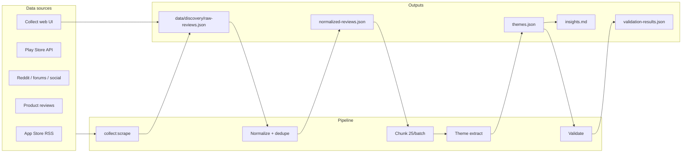

# Discovery Engine — Demonstration Guide

How the AI discovery engine answers the problem-statement research questions, with evidence from **577 normalized reviews** (649 raw) scraped from App Store, Play Store, Reddit, forums, social, and product reviews.

**Live demo:** http://localhost:3000/dashboard/discovery  
**Collect UI:** http://localhost:3001  
**Run pipeline:** `npm run discovery:all`

---

## 1. How the workflow gathers and analyzes data

| Step | Command | What it does |
|------|---------|--------------|
| **Gather** | `npm run discovery:scrape` | Scrapes 7 source types; merges into `raw-reviews.json` (deduped by text hash) |
| **Normalize** | (auto in scrape) | Trim, hash, filter min word count, chunk into batches of 25 |
| **Analyze** | `npm run pipeline:analyze` | Pattern-match reviews → 10 themes with quotes + frequency |
| **Validate** | `npm run pipeline:validate` | Quality gate: ≥2 quotes, actionable insight, evidence links |
| **Report** | `docs/discovery/insights.md` | Human-readable synthesis |

### Corpus snapshot (latest run)

| Metric | Value |
|--------|-------|
| Raw reviews | 649 |
| After normalize/filter | 577 |
| Chunks | 24 |
| Themes extracted | 10 |
| Validation | **10/10 passed** |

**Source breakdown:** Play Store 40 · App Store 121 · Reddit 136 · Forum 64 · Social 36 · Product reviews 180

---

## 2. How themes are identified

`tools/discovery-pipeline/pipelines/analyze-themes.ts` uses **rule-based theme extraction** (reproducible for demos; swap for LLM via `prompts/theme-extraction.md`):

1. Load `normalized-reviews.json`
2. For each theme definition, run regex patterns against review text
3. Count frequency across corpus
4. Attach top 3 verbatim quotes per theme (with `reviewId`, `source`, `url`)
5. Assign confidence: **high** (many matches + multi-source), **medium**, **low**
6. Write `data/discovery/themes.json`

Each theme maps to exactly one **research question** from the problem statement.

---

## 3. How insights are generated

Insights = **theme label + summary + actionable recommendation + evidence quotes**.

| Output | Location | Purpose |
|--------|----------|---------|
| Structured themes | `data/discovery/themes.json` | Machine-readable; feeds MVP RAG + dashboard |
| Narrative report | `docs/discovery/insights.md` | Deck + submission readable |
| Hypotheses | `themes.json` → `hypotheses[]` | Phase 2 interview probes |

**Example insight chain:**

> **Theme:** Reorder loops create category lock-in  
> **Evidence:** _"I just reorder from order history… browsing takes too long"_ (Reddit)  
> **Action:** Post-order nudge for one adjacent category — don't interrupt checkout

---

## 4. How insight quality was validated

Automated validation (`pipeline:validate`) checks each theme:

| Check | Requirement | Result |
|-------|-------------|--------|
| `minQuotes` | ≥2 verbatim quotes | 10/10 pass |
| `multiSource` | ≥2 source types (or low-confidence exception) | 10/10 pass |
| `actionable` | Actionable insight ≥20 chars | 10/10 pass |
| `evidenceLinked` | Every quote has `reviewId` + `url` | 10/10 pass |

Manual rubric: `docs/discovery/validation-rubric.md`  
Results: `data/discovery/validation-results.json` → **`readyForPhase2: true`**

Phase 2 interviews (`docs/research/validation-matrix.md`) then confirmed or challenged themes with real users.

---

## 5. Research questions → answers

### Q1: Why do users repeatedly buy from the same categories?

**Theme:** `theme-habit-reorder` — Reorder loops create category lock-in (56 mentions, high confidence)

**Answer:** "Buy Again" and saved lists make repeat purchasing effortless. Users open quick-commerce for a refill job, not to browse. Same 10–12 items monthly.

**Evidence:**
- _"Same list every time because I know exactly what I'll get in 10 minutes"_ — Play Store
- _"I just reorder from order history"_ — Reddit

---

### Q2: What prevents users from exploring new categories?

**Themes:** `theme-trust-risk` (79) · `theme-bad-first-experience` (68) · `theme-choice-overload` (22)

**Answer:** Three barriers stack:
1. **Trust anxiety** — personal care/baby feel risky without reviews
2. **Bad first purchase** — one wrong item permanently blocks the category
3. **Choice overload** — too many SKUs when you have 10 minutes

**Evidence:**
- _"Never tried personal care — not sure if brands are genuine"_ — Play Store
- _"One bad shampoo and I stopped exploring"_ — Forum

---

### Q3: How do users discover products today?

**Themes:** `theme-discovery-friction` (93) · `theme-social-wom` (91)

**Answer:** **Not** through in-app browse. Users discover via:
- Reorder history and search (known items only)
- Friends, WhatsApp groups, Instagram links
- Accidentally seeing someone else's order

**Evidence:**
- _"Homepage is all discounts on random stuff"_ — App Store
- _"Friend recommended specific diapers — would never have searched myself"_ — Forum

---

### Q4: What role do habits play in shopping behavior?

**Theme:** `theme-speed-transactional` (86) — 10-minute promise optimizes for speed, not exploration

**Answer:** Quick delivery trains a **transactional refill habit**. Users enter urgency mode; exploration requires a different mental state the UX never triggers.

**Evidence:**
- _"Blinkit is my emergency grocery app. Same 12 items monthly"_ — Play Store
- _"Why explore on a 10-minute delivery app?"_ — Reddit

---

### Q5: What information do users need before trying a new category?

**Themes:** `theme-incentives` (60) · `theme-choice-overload` (22) · `theme-trust-risk` (79)

**Answer:** Users need **risk reducers**, not more options:
- ₹99 trial packs, easy returns
- Bestseller badges, MRP/expiry visibility
- Curated starter packs (3–5 items), not full browse
- Social proof ("847 users tried this")

**Evidence:**
- _"Would try if there was a ₹99 trial badge and easy returns"_ — Play Store
- _"Need curated starter packs for new categories"_ — Play Store

---

### Q6: What frustrations emerge repeatedly?

**Themes:** `theme-bad-first-experience` (68) · `theme-discovery-friction` (93) · `theme-trust-risk` (79)

**Answer:** Top recurring frustrations:
1. Wrong product / wrong size → never try category again
2. Homepage feels random, not personalized
3. Can't verify authenticity for non-grocery items
4. Exploring feels like "gambling with delivery slots"

**Evidence:**
- _"Wrong size baby wipes — now I only buy baby stuff from Amazon"_ — Play Store
- _"Exploring feels like gambling"_ — Play Store

---

### Q7: Which user segments are more likely to experiment?

**Theme:** `theme-segment-students` (41) — Students and young professionals experiment more

**Answer:**
| Segment | Behavior |
|---------|----------|
| **Students / Gen Z** | Try new snacks, share links, roommate cart discovery |
| **Weekly essentials buyers** | Cautious; reorder loops; need starter packs |
| **New parents** | High need but highest risk aversion |
| **Pet owners** | Experiment only after friend recommendation |

**Evidence:**
- _"Students experiment more when friends share links"_ — Reddit
- _"Gen Z tries weird snack flavors; boomer parents stick to rice and dal"_ — Social

---

### Q8: What unmet needs emerge consistently across discussions?

**Themes:** `theme-lifestage` (18) · `theme-social-wom` (91) · `theme-incentives` (60)

**Answer:** Consistent unmet needs:
1. **Life-stage awareness** — app doesn't adapt when user becomes parent / gets pet
2. **Proactive adjacent-category suggestions** tied to order history
3. **Post-order exploration moment** — not during checkout
4. **Risk-reduced first trial** in personal care, baby, pet

**Evidence:**
- _"Just had a kid — app still shows beer and chips as top picks"_ — Forum
- _"Need reminders for categories I don't usually buy"_ — Play Store

---

## 6. Demo checklist (for submission)

- [ ] Run `npm run discovery:all` — show terminal output
- [ ] Open **Collect UI** (localhost:3001) — paste a review, show corpus count update
- [ ] Open **Discovery dashboard** (localhost:3000/dashboard/discovery) — themes + validation
- [ ] Show `data/discovery/themes.json` — quote evidence per theme
- [ ] Show `validation-results.json` — 10/10 passed
- [ ] Walk through this doc — map each research question to a theme

---

## 7. File reference

| File | Role |
|------|------|
| `tools/discovery-pipeline/scrapers/collect-all.ts` | Multi-source scraper |
| `tools/discovery-pipeline/pipelines/analyze-themes.ts` | Theme extraction |
| `tools/discovery-pipeline/pipelines/validate-insights.ts` | Quality gate |
| `data/discovery/raw-reviews.json` | Raw corpus |
| `data/discovery/themes.json` | Themes + quotes |
| `data/discovery/validation-results.json` | Validation |
| `docs/discovery/insights.md` | Narrative report |
| `docs/discovery/validation-rubric.md` | Manual rubric |
